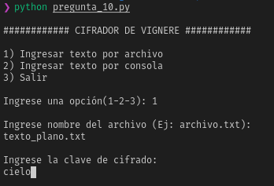
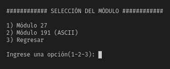
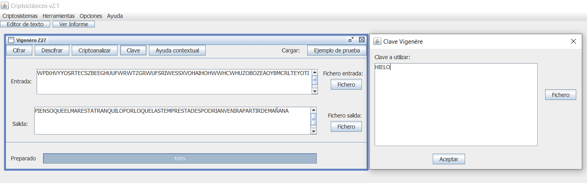

# Laboratorio 02

## CIFRADO POLIALFABÉTICO

El código fuente fue desarrollado en Python.

### 10) Implementar un cifrador de Vignere, donde se pueda seleccionar el módulo, alfabeto módulo 27 o módulo 191 (ASCII)


```python
def vignere(texto, clave, modulo):
  
  # Preprocesando texto plano
  texto, texto_claro = preprocesar(texto)
  clave = a_mayusculas(clave)

  # Para cifrar con módulo 27
  if modulo == 27:
    texto_cifrado = ""
    alfabeto = "ABCDEFGHIJKLMNÑOPQRSTUVWXYZ"
    ind = 0
    for car in texto:
      caracterText_index = alfabeto.index(car)
      caracterClav_index = alfabeto.index(clave[ind])
      posicion_cifra = (caracterText_index + caracterClav_index) % 27
      texto_cifrado += alfabeto[posicion_cifra]
      ind += 1
      if ind == len(clave): 
        ind = 0
    with open('texto-cifrado_27.txt', 'w') as output:
      output.write(texto_cifrado)
    print("TEXTO CIFRADO (modulo 27):\n\n",texto_cifrado,'\n')

  # Para cifrar con módulo 191
  elif modulo == 191:
    texto_cifrado = ""
    alfabeto = [chr(i) for i in range(33, 225)]
    ind = 0
    for car in texto:
      caracterText_index = alfabeto.index(car)
      caracterClav_index = alfabeto.index(clave[ind])
      posicion_cifra = (caracterText_index + caracterClav_index) % 191
      texto_cifrado += alfabeto[posicion_cifra]
      ind += 1
      if ind == len(clave): 
        ind = 0
    with open('texto-cifrado_191.txt', 'w') as output:
      output.write(texto_cifrado)
    print("TEXTO CIFRADO (modulo 191):\n\n",texto_cifrado,'\n')

  pausa = str(input("\nPresione enter para regresar..."))
```

<p align="center">
  
</p>
<p align="center">

</p>

#### Texto Plano

```
Hermoso es el cielo en el atardecer de tus ojos maravillosos
```

#### Resultado con módulo 27

```
JMVWDUWIDSNKMOZQMQOZCBECRGKICRGBYDDLWWWOTIZSZNWWZH
```

#### Resultado con módulo 191

```
jmvx}uwi~snkmpzqmrpzc|e}rgki}rg|y~}lwwxotiztznwwz
```

### 11) Verificar cifrando “Creer que es posible es el paso número uno hacia el éxito. Despertarse y ...". Usando la clave POSITIVO

#### Texto Plano

```
Creer que es posible es el paso número uno hacia el éxito. Despertarse y
pensar en algo positivo puede cambiar el transcurso de todo el día. No eres lo suficientemente
viejo como para no iniciar un nuevo camino hacia tus sueños. Levántate cada mañana creyendo
que vas a vivir el mejor día de tu vida.
```
#### Resultado con módulo 27

```
RGWMLYPSTHIWMPWZTSLMEXVHEBNTXZKJCDZIVPVSASPPNWYSIEWZNINHTNIMGAVGTBSSZWLDIWMPOWLJTRWKTTWWPGWSNZVBIQNZMWYSJDVWXSYWPBHMLMÑZEHNNBKDSCIWTXUOSLWWQIKKAEESZTUKWCWUPTZPBCJWDIKVAXBHOTKDOJJLAÑMJDIZWDTUOOJSUIWIHODOFIVZZNTBVWKCZKPHSDBDDGTZEMCWNRXOVMNCQWSO
```

#### Resultado con módulo 191

```
r€wm…yŠst‚w†qwzts…mxv~|‡uxz„ƒ}}zivqvs{sŠq‡wys‚~wz‡i‡t‡‚m{v€t|stzw…}‚w†q‰w…ƒtrwktuwwp€wt‡zv|‚q‡z†wysƒ}vwxtywp|m…mˆz~‡n|k~s}‚wuxv‰s…wwr‚k„{~~sztv„w}wuqtzŠ|}ƒw~‚kv{x|ptk~oƒƒ…{ˆmG}‚zw~tv‰oƒsuiwi‚oAo€ivzz‡t|vw„}z„ps~|~~€tzm}w‡rxovm‡}‹wso
```

### 15) Desarrolle un algoritmo que encuentre el texto claro si recibió la cifra WPIXHVYYOSRTECSZBEEGHUUFWRWTZGRWUFSRIWESSXVOHAIHOHWWHCWHUZOBOZEAOYBMCRLTEYOTI y se sabe que ha cifrado con la clave HIELO

```python
abc = 'ABCDEFGHIJKLMNÑOPQRSTUVWXYZ'
texto = 'WPIXHVYYOSRTECSZBEEGHUUFWRWTZGRWUFSRIWESSXVOHAIHOHWWHCWHUZOBOZEAOYBMCRLTEYOTI'
clave = 'HIELO'

def descifrar(texto,clave):
    k=0;
    descifrado=''
    for i in texto:
        TamClave = len(clave)
        a = abc.find(i)
        if (k<TamClave):
            b= abc.find(clave[k])
            k=k+1
            if k == TamClave:
               k=0
        resta = (a-b)% 27
        descifrado = descifrado + abc[resta]
    print(descifrado)
    
descifrar(texto,clave)

```

#### Resultado 

```
PIENSOQUEELMARESTATRANQUILOPORLOQUELASTEMPRESTADESPODRIANVENIRAPARTIRDEMAÑANA
```
```
PIENSO QUE EL MAR ESTA TRANQUILO POR LO QUE LAS TEMPRESTADES PODRIAN VENIR APARTIR DE MAÑANA
```

### 16) Usando el software anterior, verifique el resultado, eligiendo el cifrado Vignere con módulo 27
#### Resultado 

<p align="center">
  
</p>

### 17) Usando matemáticas discretas, descifre manualmente YGVMSSKKOX si la clave fue FORTALEZA en un alfabeto de 27 caracteres
