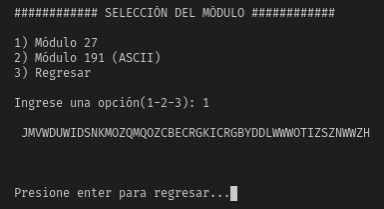
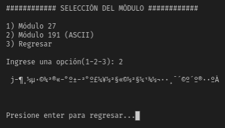
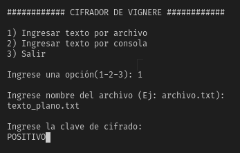
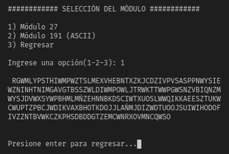
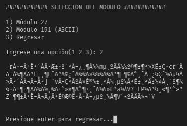
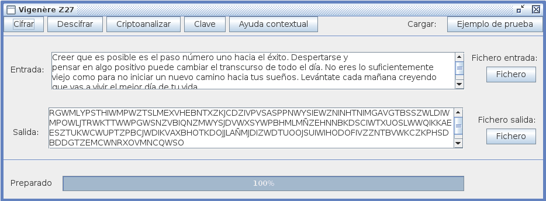
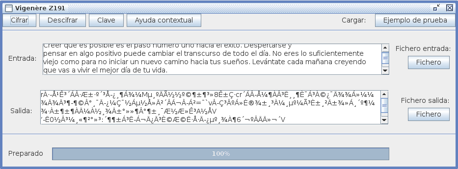

# Laboratorio 02

## CIFRADO POLIALFABÉTICO

El código fuente fue desarrollado en Python.

### 10) Implementar un cifrador de Vignere, donde se pueda seleccionar el módulo, alfabeto módulo 27 o módulo 191 (ASCII)


```python
def vignere(texto, clave, modulo):

  # Para cifrar con módulo 27
  if modulo == 27:
    # Preprocesando texto plano
    texto = preprocesar(texto)
    texto = a_mayusculas(texto)
    clave = a_mayusculas(clave)
    texto_cifrado = ""
    alfabeto = "ABCDEFGHIJKLMNÑOPQRSTUVWXYZ"
    ind = 0
    for car in texto:
      caracterText_index = alfabeto.index(car)
      caracterClav_index = alfabeto.index(clave[ind])
      posicion_cifra = (caracterText_index + caracterClav_index) % 27
      texto_cifrado += alfabeto[posicion_cifra]
      ind += 1
      if ind == len(clave): 
        ind = 0
    with open('texto-cifrado_27.txt', 'w') as output:
      output.write(texto_cifrado)
    print("\n",texto_cifrado,'\n')

  # Para cifrar con módulo 191
  elif modulo == 191:
    # Solo quitamos espacios y saltos de línea
    texto = texto.replace(' ','').replace('\n','')
    clave = a_mayusculas(clave)
    texto_cifrado = ""
    # De esta lista se excluirá carácteres con \
    alfabeto = [chr(i) for i in range(33, 256)]
    ind = 0
    for car in texto:
      caracterText_index = alfabeto.index(car)
      caracterClav_index = alfabeto.index(clave[ind])
      posicion_cifra = (caracterText_index + caracterClav_index) % 191

      # Para no contar carácteres con \
      if posicion_cifra < 94:
        texto_cifrado += alfabeto[posicion_cifra]
      elif posicion_cifra >= 94:
        posicion_cifra += 32
        if posicion_cifra >= len(alfabeto):
          posicion_cifra = posicion_cifra % 191
          texto_cifrado += alfabeto[posicion_cifra]
        else:
          # En el peor de los casos podría volver a caer en un caracter /
          if posicion_cifra == 126 or posicion_cifra == 127 or posicion_cifra == 140:
            posicion_cifra %= 32
            texto_cifrado += alfabeto[posicion_cifra]
          else:
            texto_cifrado += alfabeto[posicion_cifra]
      ind += 1
      if ind == len(clave): 
        ind = 0
    with open('texto-cifrado_191.txt', 'w') as output:
      output.write(texto_cifrado)
    print("\n",texto_cifrado,'\n')

  pausa = str(input("\nPresione enter para regresar..."))
```

<p align="center">
  
</p>
<p align="center">

</p>
<p align="center">

</p>

#### Texto Plano

```
Hermoso es el cielo en el atardecer de tus ojos maravillosos
```

#### Resultado con módulo 27

```
JMVWDUWIDSNKMOZQMQOZCBECRGKICRGBYDDLWWWOTIZSZNWWZH
```

#### Resultado con módulo 191

```
j-¶¸½µ·©¾³®«-°º±-²°º£¼¥½²§«©½²§¼¹¾½¬··¸¯´©º´º®··ºÁ
```

### 11) Verificar cifrando “Creer que es posible es el paso número uno hacia el éxito. Despertarse y ...". Usando la clave POSITIVO


<p align="center">

</p>
<p align="center">

</p>
<p align="center">

</p>

#### Texto Plano

```
Creer que es posible es el paso número uno hacia el éxito. Despertarse y
pensar en algo positivo puede cambiar el transcurso de todo el día. No eres lo suficientemente
viejo como para no iniciar un nuevo camino hacia tus sueños. Levántate cada mañana creyendo
que vas a vivir el mejor día de tu vida.
```

#### Resultado con módulo 27

```
RGWMLYPSTHIWMPWZTSLMEXVHEBNTXZKJCDZIVPVSASPPNWYSIEWZNINHTNIMGAVGTBSSZWLDIWMPOWLJTRWKTTWWPGWSNZVBIQNZMWYSJDVWXSYWPBHMLMÑZEHNNBKDSCIWTXUOSLWWQIKKAEESZTUKWCWUPTZPBCJWDIKVAXBHOTKDOJJLAÑMJDIZWDTUOOJSUIWIHODOFIVZZNTBVWKCZKPHSDBDDGTZEMCWNRXOVMNCQWSO
```

#### Resultado con módulo 191

```
rÀ·-Źʳ´Á·Ʊ·º´³Å-¿¸¶Á¾¼mµ¸ºÄý½º©¶±¶³»XʱǷcr´ÁÂ-ż¶À³˸¸¶È¯Á³À©¿¯Ä¾¾Á»¼¼¾Ä¾Ä³¶-¶©Â°¸¯Ä-¿¼Ç¯½Áµ½Å»Ä²´ÂÁ¬Â-Á²]¯`vÂ-dzºÁ»È®¾±¸³À¼¸µº¼Ã³È±¸²Ä±¾»Á¸´º¶¼¾·À±¶±¶ÀļÀ½¸¾Ä±°»»¶Â°¶±¸¯Æ½Æ»Ê³a½ÅV?-ËP½Â³¼¸«¶²°»³Z´¶¶±Á³Ë-Á¬Ä¿Ä³È©Æ©Ë·Å·Ä-¿µº¸¾À¶V´¬ºÂÄÄ»¬´V
```

### 12) Verifica el resultado obtenido a partir del cifrador Criptoclásicos v2.1

#### Resultado con módulo 27
- __Clave usada:__ POSITIVO
<p align="center">


</p>

#### Resultado con módulo 191
- __Clave usada:__ POSITIVO
<p align="center">


</p>

### 15) Desarrolle un algoritmo que encuentre el texto claro si recibió la cifra WPIXHVYYOSRTECSZBEEGHUUFWRWTZGRWUFSRIWESSXVOHAIHOHWWHCWHUZOBOZEAOYBMCRLTEYOTI y se sabe que ha cifrado con la clave HIELO

```python
abc = 'ABCDEFGHIJKLMNÑOPQRSTUVWXYZ'
texto = 'WPIXHVYYOSRTECSZBEEGHUUFWRWTZGRWUFSRIWESSXVOHAIHOHWWHCWHUZOBOZEAOYBMCRLTEYOTI'
clave = 'HIELO'

def descifrar(texto,clave):
    k=0;
    descifrado=''
    for i in texto:
        TamClave = len(clave)
        a = abc.find(i)
        if (k<TamClave):
            b= abc.find(clave[k])
            k=k+1
            if k == TamClave:
               k=0
        resta = (a-b)% 27
        descifrado = descifrado + abc[resta]
    print(descifrado)
    
descifrar(texto,clave)

```

#### Resultado 

```
PIENSOQUEELMARESTATRANQUILOPORLOQUELASTEMPRESTADESPODRIANVENIRAPARTIRDEMAÑANA
```
```
PIENSO QUE EL MAR ESTA TRANQUILO POR LO QUE LAS TEMPRESTADES PODRIAN VENIR APARTIR DE MAÑANA
```

### 16) Usando el software anterior, verifique el resultado, eligiendo el cifrado Vignere con módulo 27
#### Resultado 

<p align="center">
  
</p>

### 17) Usando matemáticas discretas, descifre manualmente YGVMSSKKOX si la clave fue FORTALEZA en un alfabeto de 27 caracteres
