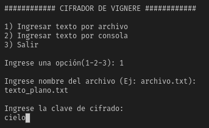

# Laboratorio 02

## CIFRADO POLIALFABÉTICO

El código fuente fue desarrollado en Python.

### 10) Implementar un cifrador de Vignere, donde se pueda seleccionar el módulo, alfabeto módulo 27 o módulo 191 (ASCII)

<p align="center">
  
</p>
<p align="center">

</p>

#### Texto Plano

```
Hermoso es el cielo en el atardecer de tus ojos maravillosos
```

#### Resultado con módulo 27

```
JMVWDUWIDSNKMOZQMQOZCBECRGKICRGBYDDLWWWOTIZSZNWWZH
```

#### Resultado con módulo 191

```
jmvx}uwi~snkmpzqmrpzc|e}rgki}rg|y~}lwwxotiztznwwz
```
